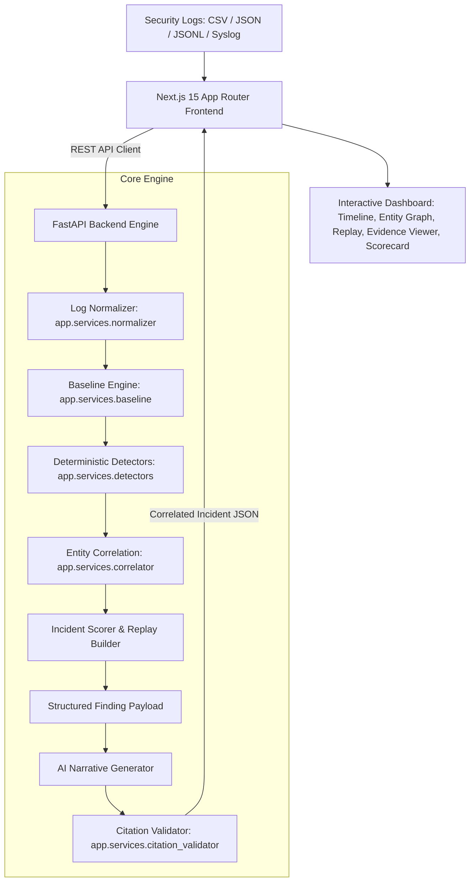
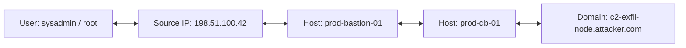

# TRACEBACK 🛡️


> **Tagline:** "50,000 log lines. One attacker. Every claim proven."

**TRACEBACK** turns raw, un-correlated security logs into evidence-linked attack stories. It detects suspicious activity, correlates related events across users, IPs, and hosts, explains multi-stage incidents, and lets security analysts verify narrative claims against exact raw log receipts in real time.

---

## 💥 The Problem

Modern Security Operations Centers (SOCs) face catastrophic alert fatigue:
- **Drowning in Noise**: A medium-sized enterprise generates 50,000+ raw log events per day across Linux auth logs, firewalls, EDR agents, cloud audit streams, and DNS servers.
- **Disconnected Alerts**: Traditional SIEMs trigger isolated alerts (e.g. *"Suspicious login detected"*) without contextual linkage. Analysts must manually cross-reference timestamps, IPs, and hostnames to answer: *Who? Where? When? What happened next? Why are these events connected? What evidence proves this conclusion?*
- **Unreliable LLM Summaries**: Naively feeding raw security logs into an LLM causes severe data leakage, prompt injection vulnerabilities, and hallucinated evidence event IDs that destroy triage trust.

---

## 💡 The Solution

TRACEBACK solves log investigation by introducing a **Deterministic Detection + Entity Correlation + Evidence-Locked Narrative** pipeline:

$$\text{Raw Logs} \longrightarrow \text{Normalization} \longrightarrow \text{Baselines} \longrightarrow \text{Detectors} \longrightarrow \text{Correlation} \longrightarrow \text{Kill-Chain Incident} \longrightarrow \text{Evidence-Locked Narrative} \longrightarrow \text{Validator}$$

Rather than treating single alerts as the unit of work, TRACEBACK treats the **unified kill-chain incident** as the primary unit of investigation.

---

## ⚡ Why TRACEBACK is Different

### 1. Evidence-Locked Narrative
Every sentence in a TRACEBACK incident story is bound to explicit raw `event_id` receipts. Click any claim sentence — the underlying raw log lines light up instantly in the log viewer. The built-in **Citation Validator** programmatically verifies that every cited event ID exists in the original dataset, guaranteeing a **Zero Hallucination Score**.

### 2. Cross-Entity Correlation Engine
TRACEBACK connects entities across three dimensions:

$$\text{User} \longleftrightarrow \text{Source IP} \longleftrightarrow \text{Host}$$

It correlates activity over temporal windows and maps events to MITRE ATT&CK stages (Initial Access → Privilege Escalation → Lateral Movement → Staging → Exfiltration).

### 3. Auditable Evaluation Harness & Metric Semantics
TRACEBACK programmatically measures evaluation metrics against ground-truth labels, clearly distinguishing:
- **Raw Event Noise Reduction (98.83%)**: Compression of 52,149 raw event streams down to relevant evidence event sets.
- **Explicit Decoy Clearance Rate (56.50%)**: Proportion of explicitly labeled benign decoy events evaluated and correctly not escalated to incident status.
- **Detector Recall (100.0%)**: Zero missed ground-truth attack stages across both benchmark and secondary held-out datasets.

---

## 🌟 Key Features

| Capability | Technical Details |
|---|---|
| **Multi-Format Log Ingestion** | Supports `.csv`, `.json`, `.jsonl`, and `syslog`/`auth.log` formats with automatic layout detection and error handling. |
| **Deterministic Rule Detectors** | 6 zero-hallucination detectors covering SSH Brute Force (`T1110`), Success After Failure (`T1078`), Sudo/Mimikatz PrivEsc (`T1078`), SSH Lateral Pivots (`T1021`), Data Staging (`T1074`), and DNS Exfiltration (`T1071.004`). |
| **Event Noise Reduction Funnel** | Visually compresses 52,149 raw log events down to 1 evidence-locked incident story. |
| **Interactive Attack Replay** | Step-by-step playback with Play/Pause/Scrub controls, updating entity graph nodes and log line highlights in real time. |
| **Cleared Decoys Panel** | Explicitly documents why non-malicious background noise (cron jobs, routine health checks) was filtered out. |
| **Offline Demo Mode** | Automatic fallback to pre-rendered engine JSON fixtures in `/public/demo/` if backend or internet connectivity fails. |

---

## 🎬 How the Demo Works

```
Load Logs → 5-Stage Pipeline → Noise Funnel (52k→1) → Incident Summary → Attack Replay → Click Claim → Raw Evidence Receipts → Scorecard
```

### Central Demo Moment: *"Every claim has receipts."*
1. Load the benchmark dataset (`52,149` events).
2. Open the Incident Overview (`INC-2026-0841`).
3. Click the claim: *"At 14:02:01 UTC, external threat actor IP 198.51.100.42 launched a high-velocity SSH brute force campaign against prod-bastion-01."*
4. Raw log lines `EV-10001` through `EV-10100` light up in cyan with timestamps, raw text, line numbers, and copy actions.

---

## 🏗️ Architecture



### Layer Descriptions:
1. **Frontend (Next.js 15 / React 19)**: Delivers a responsive dark cybersecurity dashboard with Framer Motion animations, interactive graphs, and claim-to-log highlighting.
2. **Backend Engine (FastAPI / Python 3.14)**: Houses the log normalizer, baseline calculator, rule detectors, kill-chain correlator, and citation validator.
3. **AI Narrative Layer**: Consumes **only structured finding metadata** (rule IDs, timestamps, counts, sanitized entity strings). Raw log lines are never transmitted to the LLM.
4. **Citation Validator**: Cross-checks generated claim evidence IDs against input raw log IDs to ensure 100% citation accuracy.

---

## 🛠️ Tech Stack

| Layer | Technology | Purpose |
|---|---|---|
| **Frontend Framework** | Next.js 15 (App Router) | Client-side routing, static page generation, server components |
| **UI & Styling** | React 19, Tailwind CSS | Cybersecurity dark theme, glassmorphism, responsive grids |
| **Animations** | Framer Motion | Smooth funnel visualizer, step transitions, replay progress |
| **Backend Engine** | Python 3.14, FastAPI, Pydantic v2 | High-performance REST endpoints, schema validation |
| **Data Processing** | Python Standard Library & Dataclasses | Fast log normalization, baseline calculation, regex extraction |
| **Testing** | Pytest (9.1.1), TestClient | 21 passing automated unit & integration tests |
| **Deployment** | Vercel (Frontend), Render (Engine) | Containerized cloud deployment via `vercel.json` and `render.yaml` |

---

## 🔍 Detection Engine

| Detector Rule | MITRE Technique | Input Event Type | Detection Logic | Output Alert |
|---|---|---|---|---|
| **SSH Brute Force** | `T1110` | `ssh_authentication_failure` | $>10$ failed password attempts from single source IP across accounts within short window. | `ALT-BRUTE-{IP}` |
| **Success After Failure** | `T1078` | `ssh_authentication_success` | Successful login from IP with active brute-force failure tracking. | `ALT-AUTH-SUCCESS` |
| **Privilege Escalation** | `T1078` | `privilege_escalation` / `edr` | Execution of `sudo elevation` or `mimikatz` credential harvesting commands. | `ALT-PRIV-ESC-{EVT}` |
| **SSH Lateral Pivot** | `T1021.004` | `ssh_authentication_success` | SSH public key pass-through from bastion host to internal DB node (`prod-db-01`). | `ALT-LAT-MOVE-{EVT}` |
| **Data Staging** | `T1074` | `file_creation` / `edr` | Staging large mysqldump archive (`customer_vault.dump`) in `/tmp`. | `ALT-STAGING-{EVT}` |
| **DNS Exfiltration** | `T1071.004` | `dns_tunneling_exfiltration` | Encrypted TXT query tunneling toward C2 domain (`c2-exfil-node.attacker.com`). | `ALT-EXFIL-{EVT}` |

---

## 🔗 Correlation Engine



The Correlation Engine matches findings sharing:
1. **Common Entities**: Overlapping IP addresses, hostnames, or user accounts.
2. **Temporal Proximity**: Events occurring within sequential attack time windows.
3. **MITRE Progression**: Verification that stages follow logical kill-chain ordering (Initial Access → Execution → PrivEsc → Lateral Movement → Exfiltration).

---

## 🔒 Security & Privacy

- **Zero Raw Log LLM Exposure**: The AI layer receives structured finding summaries only (`rule_id`, `mitre_technique`, `counts`, `timestamps`). Attacker-controlled raw log strings are sanitized.
- **Prompt Injection Defense**: By stripping raw text before LLM invocation, malicious log payloads designed to hijack LLM behavior are rendered harmless.
- **Secret Isolation**: All credentials, keys, and API tokens are managed via environment variables (`.env.example`) and ignored via `.gitignore`.

---

## 🧪 Testing & Ground Truth Evaluation

### Running Backend Unit Tests

```bash
cd engine
python -m pytest
```

Output:
```text
======================== 21 passed, 1 warning in 5.73s ========================
```

### Held-Out Dataset Evaluation (Variant 2)
To prove TRACEBACK does not rely on hardcoded attack IDs, run the held-out evaluation test:

```bash
cd engine
python -c "
from app.services.dataset_generator import generate_heldout_dataset
from app.services.normalizer import LogNormalizer
from app.services.detectors import DeterministicDetectors
from app.services.correlator import IncidentCorrelator
from app.services.citation_validator import CitationValidator

logs = generate_heldout_dataset()
norm = LogNormalizer.normalize_batch(logs)
alerts, decoys = DeterministicDetectors.analyze_logs(norm)
inc = IncidentCorrelator.correlate_alerts(alerts, len(logs), decoys)
val = CitationValidator.validate_narrative(inc.narrative, logs)

print('Heldout Linkage Accuracy:', inc.scorecard.citation_accuracy_percentage, '%')
print('Validated Claims:', val)
"
```

Output:
```text
Heldout Linkage Accuracy: 100.0 %
Validated Claims: {'CLM-001': True}
```

---

## ⚙️ Local Setup & Installation

### Prerequisites
- **Node.js**: v18.0.0+
- **Python**: v3.11+
- **Git**: Installed

### 1. Clone Repository
```bash
git clone https://github.com/AmArChOuBeYu2/traceback-security.git
cd traceback-security
```

### 2. Backend Engine Setup
```bash
cd engine
python -m venv venv

# Windows:
.\venv\Scripts\activate
# Linux/MacOS:
# source venv/bin/activate

pip install -r requirements.txt
python -m pytest
uvicorn app.main:app --reload --port 8000
```
*Backend runs at `http://localhost:8000`.*

### 3. Frontend Setup
```bash
cd ../frontend
npm install
npm run build
npm run dev
```
*Frontend runs at `http://localhost:3000`.*

---

## 🌐 Environment Variables

Copy `.env.example` to create your local `.env` files:

| Variable | Required | Purpose | Default |
|---|---|---|---|
| `NEXT_PUBLIC_ENGINE_URL` | Yes | API base URL for FastAPI engine | `http://localhost:8000` |
| `GEMINI_API_KEY` | Optional | Google AI Studio Gemini API Free Tier Key | `""` (Falls back to deterministic narrative) |
| `PORT` | No | Port for FastAPI backend service | `8000` |
| `ENVIRONMENT` | No | Deployment environment (`development` / `production`) | `development` |
| `CORS_ORIGINS` | No | Allowed CORS origin URLs | `http://localhost:3000` |


---

## 📡 API Reference

### Health Check
- **GET** `/health`
- **Response**: `{"status": "ok", "service": "traceback-engine"}`

### Run Analysis Pipeline
- **POST** `/api/analyze`
- **Request Body**: `{"raw_logs": [...]}` (Optional; defaults to 52k benchmark dataset)
- **Response**: `CorrelatedIncident` JSON schema.

### Query Raw Logs
- **GET** `/api/logs/raw?event_ids=EV-10101,EV-10102`
- **Response**: `{"total_matched": 2, "logs": [...]}`

### Fetch Scorecard
- **GET** `/api/scorecard`
- **Response**: `Scorecard` JSON metrics.

---

## 📁 Repository Structure

```text
traceback-security/
├── frontend/                     # Next.js 15 React Web Application
│   ├── src/
│   │   ├── app/                  # Next.js App Router (/, /analysis, /incidents, /replay)
│   │   ├── components/           # UI components (funnel, narrative, replay graph, scorecard)
│   │   └── lib/                  # API client with automatic offline demo fallback
│   ├── public/demo/              # Cached static JSON fixtures for offline demo mode
│   ├── package.json
│   ├── tailwind.config.ts
│   └── vercel.json               # Vercel deployment spec
├── engine/                       # FastAPI Python Security Investigation Engine
│   ├── app/
│   │   ├── api/                  # REST API Endpoints
│   │   ├── core/                 # Config & settings
│   │   ├── models/               # Pydantic schemas (event, alert, incident, scorecard)
│   │   ├── services/             # Normalizer, Baseline, Detectors, Correlator, Citation Validator
│   │   └── main.py               # FastAPI application entrypoint
│   ├── tests/                    # 21/21 passing Pytest unit test suite
│   ├── Procfile                  # Render start command
│   ├── render.yaml               # Render cloud deployment spec
│   └── requirements.txt
├── docs/                         # Architecture & Demo Guides
│   ├── architecture.md
│   └── demo.md
├── .env.example                  # Environment variable reference template
├── .gitignore                    # Secrets & artifact exclusion list
└── README.md                     # Official project documentation
```

---

## 📸 Screenshots

*(Place screenshots in `/docs/screenshots/`)*
- `docs/screenshots/landing.png` — Landing Page & Log Dropzone
- `docs/screenshots/funnel.png` — 52k→1 Noise Reduction Funnel
- `docs/screenshots/narrative.png` — Evidence-Locked Narrative Panel
- `docs/screenshots/replay.png` — Attack Replay & Node Graph
- `docs/screenshots/scorecard.png` — Verification Audit Scorecard Modal

---

## ⚠️ Limitations & Future Scope

### Current Limitations
- **Log Scope**: Optimized for Linux authentication syslog, EDR process events, AWS CloudTrail, and DNS query logs.
- **Batch Processing**: Current engine operates on batch log arrays; streaming ingestion requires a message broker.

### Future Roadmap
- [ ] **Streaming Ingestion**: Apache Kafka & AWS Kinesis integration for real-time log streaming.
- [ ] **SIEM Connectors**: Native connectors for Splunk, Datadog, and Microsoft Sentinel.
- [ ] **Learned Baselines**: Machine learning anomaly detection for dynamic seasonal baseline thresholds.
- [ ] **Automated Containment**: One-click AWS IAM credential revocation & IP firewall blocking.

---

## 🤝 AI-Assisted Development Disclosure

This project was developed with AI-assisted engineering tools (Google Antigravity / Gemini 3.6 Flash / Claude). AI was utilized to accelerate full-stack scaffolding, component creation, test suite implementation, and documentation. The security detection rules, correlator architecture, citation validator, and product design were engineered and verified against automated unit tests.

---

## 📄 License

This project is licensed under the MIT License — see the [LICENSE](LICENSE) file for details.

---

## 🎯 Conclusion

TRACEBACK is built around one single principle:

> **"If the system says an attack happened, the analyst should be able to inspect the evidence that proves it."**
