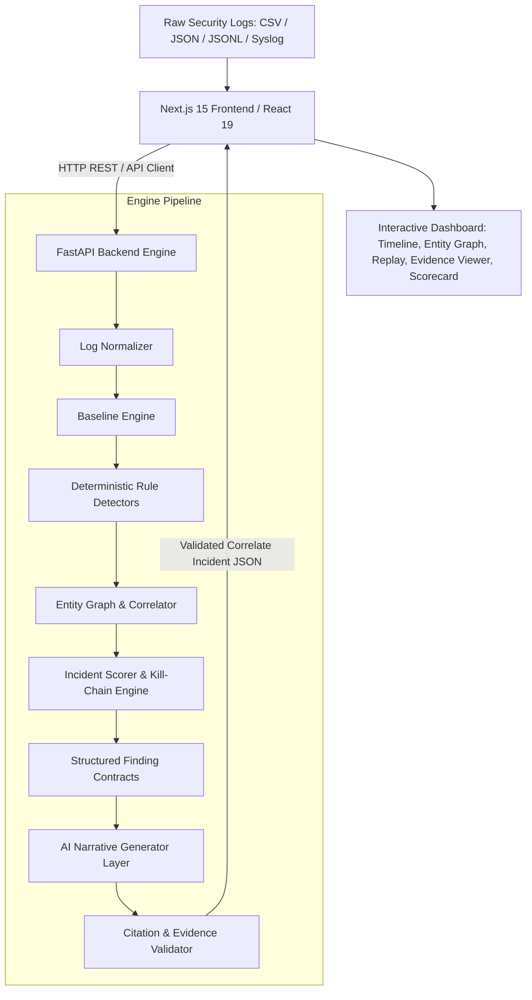

# TRACEBACK Architecture & Technical Reference 🛡️

## System Architecture

## Core Pipeline Components

### 1. Log Normalizer (`app.services.normalizer`)
- Maps heterogeneous raw logs (auth.log, Syslog, EDR process creation, CloudTrail JSON, Nginx access logs, DNS query logs) into a unified schema:
  - `event_id`, `timestamp`, `log_source`, `user`, `source_ip`, `hostname`, `action`, `outcome`, `resource`, `raw_text`

### 2. Baseline Engine (`app.services.baseline`)
- Calculates statistical entity baselines for logon frequencies, source IP geo-distributions, and off-hours activity.

### 3. Deterministic Detectors (`app.services.detectors`)
- Runs 6 zero-hallucination rule detectors:
  1. **SSH Brute Force** (`RULE-T1110`): Detects high-velocity authentication failures from single source IP across accounts.
  2. **Success After Failures** (`RULE-T1078`): Identifies authenticated logins immediately following brute-force sequences.
  3. **Privilege Escalation & Mimikatz** (`RULE-T1078`): Flag sudo elevations and in-memory credential harvesting commands.
  4. **SSH Lateral Movement** (`RULE-T1021`): Detects SSH pivots between internal hosts (e.g., bastion → database cluster).
  5. **Data Staging** (`RULE-T1074`): Flags large file archives and mysqldumps in temporary paths (`/tmp/customer_vault.dump`).
  6. **DNS Exfiltration** (`RULE-T1071.004`): Identifies high-frequency encoded TXT query tunneling toward C2 domains.

### 4. Incident Correlator (`app.services.correlator`)
- Merges related alerts by matching overlapping entities (user, source IP, hostname), temporal windows, and MITRE attack stages.
- Synthesizes dynamic attack replay steps and evidence-locked claims.

### 5. Citation Validator (`app.services.citation_validator`)
- Inspects every generated narrative claim and validates that all cited `evidence_event_ids` exist in the raw input logs.
- Rejects invalid citations and computes exact evidence linkage accuracy percentages.
